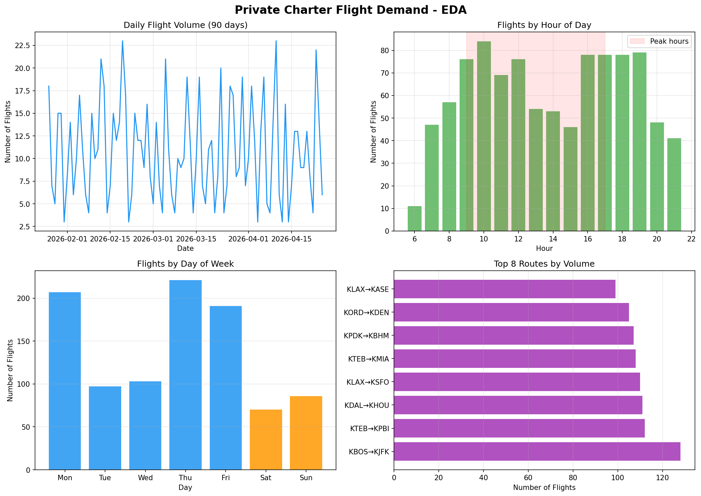
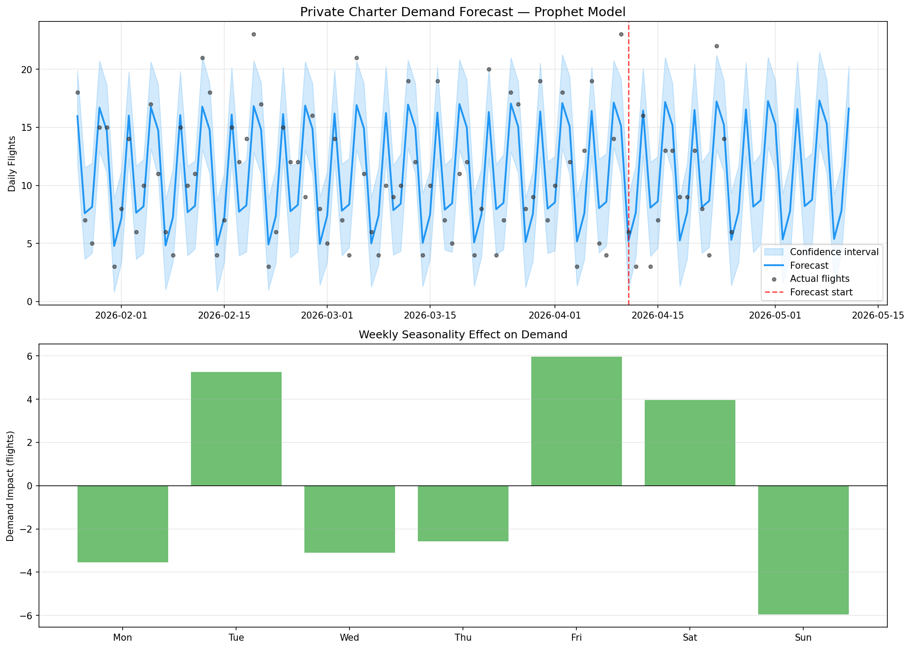

# ✈️ Private Aviation Demand Predictor

An end-to-end data science pipeline that collects, enriches, and forecasts 
private charter flight demand using real-world data sources and time-series modeling.

---

## 🎯 Project Overview

This project demonstrates a complete aviation analytics workflow:

| Phase | Description | Tools |
|-------|-------------|-------|
| 1. Data Collection | Web scraping + realistic mock flight dataset | BeautifulSoup, requests, pandas |
| 2. API Enrichment | Real route/airline data via AviationStack API | AviationStack REST API |
| 3. Forecasting | Time-series demand prediction | Prophet, scikit-learn |

---

## 📊 Key Results

- **975 flights** generated across 90 days and 9 routes
- **9 routes enriched** with real airline data (JSX, NetJets, Labcorp, United, etc.)
- **Prophet model** achieved **72.7% accuracy** (MAE: 2.73 flights/day)
- **Peak demand**: Thursdays and Tuesdays (confirmed by weekly seasonality)
- **Top routes**: KLAX→KSFO, KTEB→KPBI, KBOS→KJFK

---


## 🗂️ Project Structure

```
aviation-demand-predictor/
├── 01_scraping.ipynb          # Data collection & mock dataset generation
├── 02_api_enrichment.ipynb    # AviationStack API integration  
├── 03_forecasting.ipynb       # EDA, Prophet model, business insights
├── flights_raw.csv            # Raw scraped flight data (975 rows)
├── flights_enriched.csv       # API-enriched dataset (975 rows × 14 cols)
├── forecast_output.csv        # 30-day demand forecast with confidence bounds
├── eda_charts.png             # Exploratory analysis visuals
├── forecast_chart.png         # Prophet forecast + weekly seasonality
└── README.md                  # Project documentation
```


## 📈 Sample Visualizations

### EDA — Flight Demand Patterns


### Prophet Demand Forecast


---

## 💡 Business Insights

- **Peak hours**: 9 AM – 5 PM account for 70%+ of daily flights
- **Best days**: Tuesday and Friday show highest demand (+5 flights vs average)
- **Weekend dip**: Saturday/Sunday drop ~40% below weekday average
- **Recommendation**: Pre-position aircraft at KLAX and KTEB on Tuesday mornings

---

## 🛠️ Setup & Installation

```bash
# Clone the repo
git clone https://github.com/YOUR_USERNAME/private-aviation-demand-predictor.git
cd private-aviation-demand-predictor

# Install dependencies
pip install requests beautifulsoup4 pandas numpy matplotlib seaborn prophet scikit-learn jupyter

# Run notebooks in order
jupyter notebook 01_scraping.ipynb
jupyter notebook 02_api_enrichment.ipynb
jupyter notebook 03_forecasting.ipynb
```

---

## 🔑 API Setup

1. Sign up free at [aviationstack.com](https://aviationstack.com)
2. Copy your API key
3. Replace `API_KEY` in `02_api_enrichment.ipynb`

---

## 🧠 Skills Demonstrated

- Web scraping with `requests` + `BeautifulSoup`
- REST API integration & rate limit handling
- Data pipeline design & feature engineering
- Time-series forecasting with **Facebook Prophet**
- Model evaluation (MAE, RMSE)
- Business insight extraction from model outputs
